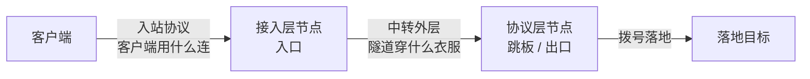

# 协议说明

APIC 的链路有两段，各自有一套「协议」概念，先分清楚它们：

- **入站协议**：客户端连接入口时说的「话」。决定接入层这一跳长什么样（明文转发、自研壳、Trojan、TUIC、VLESS+REALITY）。
- **中转外层**：入口到出口这段隧道的外层伪装。隧道**内层恒为 AES-AEAD**，外层只是「穿什么衣服」过墙（裸 AES、自研壳、TLS、REALITY、quic-obfs）。

一条规则**直连**时只有入站协议；**中转**时入站协议 + 中转外层两段都要选。

!!! tip "怎么快速决定"
    入站协议看「客户端是什么」——客户端是浏览器/系统直连就用明文或壳；客户端是 sing-box/v2rayN 这类才用 Trojan/TUIC/VLESS。中转外层看「这一跳过不过墙、有多敌对」——同机房用裸 AES，普通跨墙用壳，最敌对用 quic-obfs。

---

## 一、入站协议（接入层）

客户端直接连接入口时用的协议。在规则编辑器里对应「隧道协议 / 入站协议」下拉。

| 协议 | 适用客户端 | 说明 |
| --- | --- | --- |
| **明文转发** | 任意（含浏览器、系统代理、游戏） | 不加密、不伪装，纯 TCP/UDP 端口转发。最快，链路本身要可信。 |
| **自研壳** | 配套自研壳客户端 | utls 真 Chrome 指纹 + 整形，把入站流量伪装成正常 HTTPS。通用跨墙。 |
| **Trojan** | sing-box / v2rayN / Shadowrocket 等 | Trojan-over-TLS。客户端用现成 Trojan 客户端即可接入，需配证书。 |
| **TUIC** | sing-box / Nekoray / v2rayN / Shadowrocket | TUIC v5，基于 QUIC。抗丢包、0-RTT，需配证书。客户端只需 UUID + 密码 + alpn=h3。 |
| **VLESS + REALITY** | Xray 系客户端 | 借真站证书的 REALITY，IP↔域名能对上，最隐蔽。需填一个真实大站作 dest。 |

!!! note "证书来源"
    Trojan / TUIC 需要 TLS 证书。规则里可选 **自签**（默认，客户端需允许不安全）、**自定义 PEM**（你贴证书链 + 私钥）、**Let's Encrypt 自动**（填域名自动申请）。

---

## 二、中转外层（协议层）

仅**中转规则**有这一段，对应规则高级编辑里的「出口协议 / 中转外层」。**隧道内层始终是 AES-AEAD，这里只换外层伪装。**

不同外层用**不同端口**（出口跳板的 relay 基准口 + 偏移），互不干扰：

| 外层 | 端口偏移 | 线上特征 | 适用 |
| --- | --- | --- | --- |
| **裸 AES**（`aes`） | base + 0 | 无伪装 | 同机房 / 可信链路，最快 |
| **自研壳**（`shell`） | base + 1 | 真 Chrome TLS 指纹 + 整形 | 通用跨墙 |
| **TLS**（`tls`） | base + 2 | 标准 TLS 握手 + 伪装 SNI | TLS 形态、要明文 SNI 时 |
| **REALITY**（`reality`） | base + 3 | 借真站证书，IP↔域名一致 | 最隐蔽，但要配真站 dest |
| **quic-obfs**（`quic-obfs`） | base + 5 | 整包加扰，**线上无明文 SNI** | 最敌对跨墙跳、高丢包链路 |

（base = 出口节点装机时配的 relay 基准口，如 9100。）

### 选型建议

=== "通用跨墙"
    **自研壳**。真 Chrome JA3/JA4 指纹，默认带填充量化 + 写入抖动 + keepalive 整形 + decoy 主动探测防御，开箱即用。

=== "最敌对（强 DPI / QUIC 审查）"
    **quic-obfs**。整包加扰、线上无明文 SNI，绕开「IP↔SNI 不一致」识别。高丢包链路也优于 TCP（避免 TCP-over-TCP）。

=== "最隐蔽（要对上 IP↔域名）"
    **REALITY**。借一个真实大站的证书，服务端把未授权探测透明代理到该真站，看到的是货真价实的证书与响应。需填真站 dest（如 `www.apple.com:443`），且出口 IP 要可能托管该站。

=== "同机房 / 可信链路"
    **裸 AES**。无伪装开销，最快。

!!! warning "quic-obfs 升级须知"
    quic-obfs 的 wire 格式在 v1.9.0 改过，**老↔新不兼容**。用 quic-obfs 的那一跳，入口 + 出口**两端节点必须同时升级**到 v1.9.0 及以上，升级窗口该模式短暂断流（其它模式不受影响）。

!!! danger "原生 quic 档已移除"
    原生 `quic` 中转档已在 v1.8.0 移除。线上若还有 `relay_mode=quic` 的老规则，请改成 `quic-obfs`。

---

## 三、伪装的边界（实话实说）

换 IP / 换外层能解决大部分链路特征，但有一类问题**协议层解决不了**：数据中心 IP 在深层情报里被标记为「机房 IP」，而你的 SNI 声称是大站——这种 **IP↔ASN 深层不一致**，shell/tls 都对不上。

- 要彻底对上 IP↔域名，用 **REALITY**（借真站，出口 IP 能托管该站）。
- 或用 **quic-obfs**（线上无明文 SNI，绕开这个识别维度）。

流量阈值封 IP（如单 IP 约 100GB/48h 被封）则靠面板的**出口 IP 池轮换 + 单 IP 限量**对抗，见 [参数说明](advanced.md#exit-ip-cap) 的 `exit_ip_cap_*`。

---

下一步：[参数说明](advanced.md) 了解每个外层的整形参数，或 [高级编辑逐项](fields.md) 看规则编辑器每个字段。
