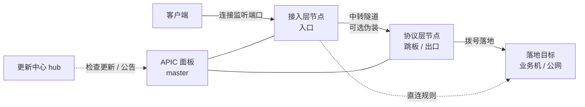

# APIC 介绍

APIC 是一套**中转 / 转发 + CDN 面板**,用于自建端口转发、链路中转与加速服务。一套面板管理多台节点,在节点之间做隧道中转、协议伪装与流量计费,适合运营转发线路、加速业务或搭建抗封锁通道的团队。

!!! tip "本文面向谁"
    面向**部署并运营 APIC 面板的运营者**。如果你是线路的最终用户,通常只需向你的运营方索取连接信息即可,无需阅读本手册。

## 能做什么

- **多协议中转转发**:传统 TCP+UDP 端口转发,以及单端口入 SNI 分流。
- **链路伪装**:中转隧道可选裸 AES、自研壳、TLS、REALITY、QUIC / QUIC+混淆等外层,适配不同网络环境与抗封需求。
- **线路分组**:把节点编入"线路"(分组),按层级(接入层 / 协议层)、用户等级、计费倍率统一管理。
- **流量计费**:按字节计量,入口 / 出口分别按倍率折算"已消耗流量",口径与同类面板(nyanpass)一致,便于迁移。
- **节点管理**:节点上线状态、IPv6 能力、连接数(TCP/UDP 分列)、协议版本一目了然。
- **集中更新与公告**:面板可一键检查更新(签名校验),更新日志 / 公告由官方统一下发。

## 架构总览

三类角色:

| 组件 | 说明 |
| --- | --- |
| **面板(master)** | 你部署的管理后台 + Web 界面,管理节点、线路、规则、用户、计费。 |
| **节点(agent)** | 装在每台服务器上的程序,接受面板下发的规则,执行转发 / 中转 / 落地。 |
| **更新中心(hub)** | 官方维护,向所有已部署面板提供签名更新包与更新公告。你无需自建。 |

## 两层模型:接入层与协议层

APIC 把节点按用途分两层,这是理解线路与规则的关键:

- **接入层(入口)**:客户端直接连接的节点。规则的"监听端口"开在这里。
- **协议层(跳板 / 出口)**:中转规则里数据从接入层穿过隧道到达的下一跳,由它拨号落地。

一条规则要么**直连**(接入层本机直接落地),要么**中转**(接入层 → 协议层 → 落地)。中转时两节点之间走隧道,可加伪装外层。

## 核心概念速览

- **线路 / 分组**:一组同类节点的集合,带"层 / 等级 / 倍率"。用户在规则里按线路选入口或出口,而不是逐台选机器。
- **倍率**:线路内所有节点的流量按此倍率折算计入用量(贵的落地设高倍率)。
- **落地**:转发的最终目的地(业务机或公网目标)。
- **伪装档**:中转隧道的外层伪装方式,决定链路"看起来像什么"。

下一步:从 [安装部署](guide/install.md) 开始,或直接看 [线路 · 节点 · 规则](guide/usage.md) 了解日常配置。
