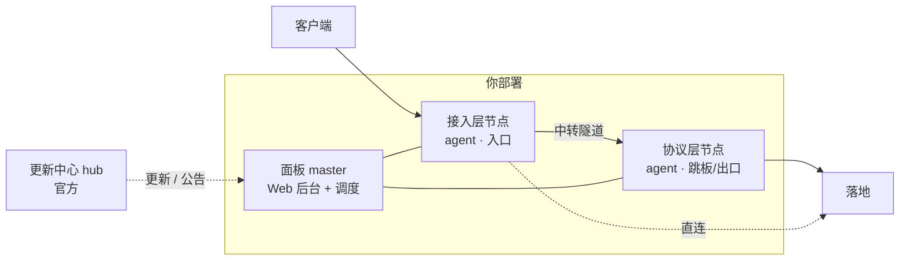

# 参考

## 架构

- **面板(master)**:管理后台与调度核心,把规则下发给节点。
- **节点(agent)**:执行转发 / 中转 / 落地;按层分为接入层、协议层。
- **更新中心(hub)**:官方维护,提供签名更新与公告。

## 名词表

| 名词 | 含义 |
| --- | --- |
| **接入层 / 入口** | 客户端直接连接的节点;规则的监听端口开在这里。 |
| **协议层 / 跳板 / 出口** | 中转规则里数据穿过隧道到达的下一跳,由它拨号落地。 |
| **线路 / 分组** | 一组同类节点的集合,带"层 / 等级 / 倍率",是规则选入口 / 出口的单位。 |
| **落地** | 转发的最终目的地(`IP/域名:端口`)。 |
| **直连** | 入口本机直接拨落地,不经协议层。 |
| **中转** | 入口 → 协议层 → 落地,两节点间走隧道。 |
| **伪装档** | 中转隧道的外层伪装方式。 |
| **倍率** | 线路内节点流量的计费折算系数。 |
| **等级** | 用户等级 ≥ 线路等级 才可选用该线路。 |

## 规则字段

| 字段 | 取值 / 说明 |
| --- | --- |
| 入口 · 接入层 | 接入层线路 / 某入口机 |
| 监听端口 | 1–65535 |
| 落地地址 | `IP/域名:端口` |
| 出口 · 协议层 | 直连 / 协议层线路 / 某跳板机 |
| 转发方式 | 传统(TCP+UDP) / 单端口入 SNI(仅 TCP) |
| 中转链路伪装档 | 裸 AES / 自研壳 / TLS / REALITY / QUIC / QUIC+混淆(仅中转) |
| PROXY protocol | 关 / V1 接收 / V2 发送 / V3 收发 |
| 入口出站模式 | 跟随系统(双栈) / IPv4-only / IPv6-only |
| 入口出站源 IP | 单 / 多;留空=系统默认 |
| 出口出站模式 / 源 IP | 同上,仅选了出口时生效 |
| 备注名 | 自定义 |
| 高级配置（JSON） | 出口 IP 轮换 / 限量、链路整形、接入层入站连接保护等进阶项 → 见 [高级参数](guide/advanced.md) |

## 伪装档对照

| 伪装档 | 传输 | 特点 | 适用 |
| --- | --- | --- | --- |
| 裸 AES | TCP | 最快,无外层 | 专线 / 可信链路 |
| 自研壳 | TCP | 多态私有特征 | 通用抗识别 |
| TCP + TLS | TCP | 像 HTTPS(自签证书) | 需"像网页流量" |
| REALITY | TCP | 借真站点证书,抗主动探测 | 强探测环境 |
| QUIC | UDP | h3 握手伪装 | UDP 可通、规避 TLS-in-TLS |
| QUIC + 混淆 | UDP | 像随机 UDP(salamander) | 抗 QUIC 指纹 / SNI |

## 出站模式对照

| 模式 | 行为 |
| --- | --- |
| 跟随系统(双栈) | 优先 IPv6、回落 IPv4;节点 / 目标具备什么用什么。**默认推荐**。 |
| IPv4-only | 强制走 IPv4,无回落。 |
| IPv6-only | 强制走 IPv6,无回落(节点 / 目标无 v6 则失败)。 |

## 计费口径

> **已消耗(计费)流量 = 入口净荷 × 入口倍率 + 出口净荷 × 出口倍率**

- 按字节计量;倍率配在线路上。
- 口径与 nyanpass 一致,迁移无需重算逻辑。
- 面板同时展示"使用流量"(实际)与"已消耗"(计费)。

## 服务与组件

| 组件 | systemd 服务 | 谁维护 |
| --- | --- | --- |
| 面板 master | `fp-master`(以你部署为准) | 你 |
| 节点 agent | `fp-agent` | 你 |
| 更新中心 hub | — | 官方 |

## 协议版本

节点 agent 有独立的**协议版本**。面板提升协议版本后,落后的节点显示"需更新",需重新部署 agent 才能用上新能力。
